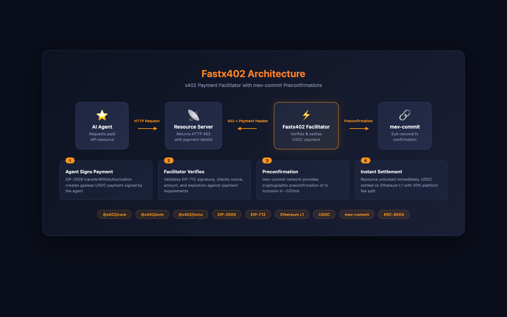

# Mainnet x402 Facilitator

**First x402 facilitator on Ethereum mainnet. First to use preconfirmations for sub-second USDC settlement.**

## The Problem

AI agents need to pay for APIs, compute, and data in real-time. Traditional Ethereum payments are too slow (12+ seconds for finality). Existing x402 facilitators only work on Base and Solana, leaving agents unable to access Ethereum's $100B+ in stablecoins and DeFi liquidity.

## The Solution

| Feature | Value |
|---------|-------|
| **Sub-second settlement** | ~1.2s end-to-end via FastRPC preconfirmations (vs 12+ seconds) |
| **Zero gas for agents** | Agents only need USDC — no ETH required, gas fully sponsored |
| **Mainnet liquidity** | Access Ethereum's largest stablecoin issuance |
| **x402 compatible** | Drop-in replacement for Base/Solana facilitators |
| **EIP-3009** | Gasless `transferWithAuthorization` signatures |

## Live API

```
https://facilitator.primev.xyz
```

| Endpoint | Description |
|----------|-------------|
| `POST /settle` | Verify + settle payment via FastRPC preconfirmation |
| `POST /verify` | Validate signature, balance, nonce (dry run) |
| `GET /supported` | Return supported schemes and networks |

## How It Works



```
Agent                     Resource Server              Facilitator              FastRPC
  │                             │                           │                      │
  │── GET /resource ───────────>│                           │                      │
  │<── 402 + PaymentRequired ───│                           │                      │
  │                             │                           │                      │
  │ (signs transferWithAuthorization - no gas, no ETH)      │                      │
  │                             │                           │                      │
  │── GET /resource ───────────>│                           │                      │
  │   + PAYMENT-SIGNATURE       │── POST /settle ──────────>│── preconfirm ───────>│
  │                             │<── { success, txHash } ───│<── ~100-200ms ───────│
  │<── 200 + response ──────────│                           │                      │
```

1. Agent requests paid resource → receives 402 with payment requirements
2. Agent signs EIP-3009 `transferWithAuthorization` (just a signature, no tx, no gas)
3. Agent retries with signature → server calls `/settle`
4. Facilitator submits to FastRPC → preconfirmed in ~100-200ms
5. Agent receives response immediately

## Proof of Work

Confirmed mainnet transactions:

- [0x25919e...](https://etherscan.io/tx/0x25919e07099342b90383c2bbf5fa7512a8982be94276ad2460b94da4a2b29650) — 1 USDC
- [0x1e3fd5...](https://etherscan.io/tx/0x1e3fd527772dd07b7a6f6b9df0aa6ef65b8dd55eb3cf7ab066ee287e238f7a5c) — 1 USDC
- [0x4e8bf1...](https://etherscan.io/tx/0x4e8bf1ea2022fb896bf54c1890f240d329f8796ddc4f8ab636fc1174b47c57de) — 1 USDC (1.2s end-to-end)

## Agent Integration

### With x402 Libraries (Recommended)

```typescript
import { withX402 } from "@x402/axios";

const client = withX402(axios, { walletClient });
const response = await client.get("https://api.example.com/paid-endpoint");
// Payment signed and settled automatically on 402 response
```

### Direct API Usage

```typescript
import { createWalletClient, http } from 'viem'
import { privateKeyToAccount } from 'viem/accounts'
import { mainnet } from 'viem/chains'
import { randomBytes } from 'crypto'

const USDC = '0xA0b86991c6218b36c1d19D4a2e9Eb0cE3606eB48'
const FACILITATOR = 'https://facilitator.primev.xyz'

// Sign EIP-3009 authorization
const signature = await walletClient.signTypedData({
  domain: { name: 'USD Coin', version: '2', chainId: 1, verifyingContract: USDC },
  types: {
    TransferWithAuthorization: [
      { name: 'from', type: 'address' },
      { name: 'to', type: 'address' },
      { name: 'value', type: 'uint256' },
      { name: 'validAfter', type: 'uint256' },
      { name: 'validBefore', type: 'uint256' },
      { name: 'nonce', type: 'bytes32' },
    ],
  },
  primaryType: 'TransferWithAuthorization',
  message: {
    from: account.address,
    to: merchantAddress,
    value: BigInt(amount),
    validAfter: 0n,
    validBefore: BigInt(Math.floor(Date.now() / 1000) + 900),
    nonce: `0x${randomBytes(32).toString('hex')}`,
  },
})

// Settle payment
const result = await fetch(`${FACILITATOR}/settle`, {
  method: 'POST',
  headers: { 'Content-Type': 'application/json' },
  body: JSON.stringify({ paymentPayload, paymentRequirements }),
}).then(r => r.json())

// { success: true, transaction: "0x...", network: "eip155:1" }
```

## Server Integration

```typescript
import { paymentMiddleware } from "@x402/express";

app.use(paymentMiddleware({
  "GET /api/data": {
    accepts: [{
      scheme: "exact",
      network: "eip155:1",
      amount: "1000000", // 1 USDC
      asset: "0xA0b86991c6218b36c1d19D4a2e9Eb0cE3606eB48",
      payTo: "0xYourAddress",
      maxTimeoutSeconds: 60,
    }],
  },
}, { facilitatorUrl: "https://facilitator.primev.xyz" }));
```

## Error Codes

| Code | Description |
|------|-------------|
| `invalid_signature` | EIP-712 signature verification failed |
| `insufficient_funds` | Payer doesn't have enough USDC |
| `nonce_already_used` | Replay protection triggered |
| `authorization_expired` | Current time is after `validBefore` |
| `recipient_mismatch` | `to` doesn't match `payTo` |
| `insufficient_payment` | `value` is less than required `amount` |

## Development

```bash
# Run tests
cd contracts && forge test -vvv

# Local dev
cd api && vercel dev

# Deploy
cd api && vercel --prod
```

### Environment Variables

| Variable | Description |
|----------|-------------|
| `RELAY_PRIVATE_KEY` | Hot wallet for settlement txs |
| `RPC_URL` | Ethereum mainnet RPC |

## Architecture

```
api/
├── index.ts      # Hono routes
├── settle.ts     # FastRPC submission
├── verify.ts     # EIP-712 signature verification
├── config.ts     # USDC address, FastRPC URL
├── types.ts      # x402 protocol types
└── abi.ts        # USDC ABI
```

## Registry & Ecosystem Listings

| Registry | Status | Link |
|----------|--------|------|
| **ERC-8004 Identity** | Registered — Agent #23175 | [Etherscan NFT](https://etherscan.io/nft/0x8004A169FB4a3325136EB29fA0ceB6D2e539a432/23175) |
| **x402 Ecosystem** (coinbase/x402) | PR open | [PR #1114](https://github.com/coinbase/x402/pull/1114) |
| **x402scan Explorer** (Merit-Systems) | PR open | [PR #624](https://github.com/Merit-Systems/x402scan/pull/624) |
| **awesome-x402** (xpaysh) | PR open | [PR #11](https://github.com/xpaysh/awesome-x402/pull/11) |
| **awesome-x402** (Merit-Systems) | PR open | [PR #29](https://github.com/Merit-Systems/awesome-x402/pull/29) |
| **awesome-erc8004** | PR open | [PR #3](https://github.com/sudeepb02/awesome-erc8004/pull/3) |
| **x402.watch Directory** | Pending — Ethereum mainnet not yet supported | [x402.watch](https://x402.watch/facilitators) |
| **x402 Bazaar** | Live | `/supported` + `/discovery/resources` |

> **Note:** x402.watch currently only lists facilitators on Base, Polygon, and Solana. Ethereum mainnet support has been requested — once added, this facilitator will be listed as "Primev – Ethereum Mainnet with Preconfs" at `https://facilitator.primev.xyz`.

## Links

- [x402 Protocol](https://github.com/coinbase/x402)
- [Primev FastRPC](https://docs.primev.xyz/v1.1.0/get-started/fastrpc)
- [EIP-3009](https://eips.ethereum.org/EIPS/eip-3009)
- [mev-commit](https://docs.primev.xyz/)
- [x402.watch Facilitator Directory](https://x402.watch/facilitators)
- [8004agents.ai Explorer](https://8004agents.ai)
